# 本地大模型实时性能监控测试平台

面向本地部署大语言模型（Ollama / vLLM / llama.cpp / OpenAI 兼容端点）的一站式
**实时监控 · 基准测试 · 并发压测 · 能力评测** Web 平台。按《本地大模型实时性能监控测试平台开发手册》
的 6 阶段方案完整实现。

```
FastAPI + WebSocket + SQLite + ECharts 5 · 薄前端 + 本地采集后端两层架构
```

七个面板：**实时看板**（左性能 / 右对话）· **连接管理** · **基准套件** · **评测中心** ·
**并发压测** · **历史对比** · **告警阈值**。

---

## 1. 快速开始

```bash
pip install -r requirements.txt
python -m uvicorn backend.main:app --host 0.0.0.0 --port 8080
# 浏览器打开 http://localhost:8080
```

或使用一键脚本：

* Windows：`run.bat`
* macOS / Linux / Git Bash：`bash run.sh`

环境变量（可选）：`LLM_MONITOR_HOST` / `LLM_MONITOR_PORT` / `LLM_MONITOR_DB` /
`LLM_MONITOR_SAMPLE_INTERVAL` / `LLM_MONITOR_RETENTION_DAYS`。

> **端口**：默认 8080。如果 8080 已被你自己的推理服务占用（例如本地 `llama-server`），
> 用 `LLM_MONITOR_PORT=8081 bash run.sh` 换个端口即可 —— 服务本身不与推理后端抢端口，
> 它只是通过 HTTP 去连后端。

**开箱即用**：首次启动会自动种入一个「内置演示模型」连接档案，无需任何真实推理服务即可体验
全部功能（含模拟流式输出、性能打点、压测曲线）。要接入真实服务，到「连接管理」新增即可。

> 环境要求：Python 3.11+。GPU 指标依赖 NVIDIA 驱动；无 NVIDIA 设备时自动降级为
> 「模拟 GPU」曲线（界面会明确标注「GPU 模拟数据」），不会报错。

---

## 2. 目录结构

```
llm-monitor/
├── backend/
│   ├── main.py            FastAPI 入口：REST 路由 + WebSocket + 静态托管
│   ├── config.py          全局配置（路径 / 采样频率 / 熔断阈值）
│   ├── collector.py       硬件与推理指标采集（psutil + pynvml，含模拟降级）
│   ├── probe.py           推理后端适配层（统一归一化流式接口）+ 效率指标归一化
│   ├── chat.py            对话上下文装配：预算裁剪 / 长期记忆注入与合并 / 重新生成去重
│   ├── tester.py          测试引擎：单条 / 基准套件 / 并发压测 / 并发拐点建议
│   ├── evaluator.py       评测引擎：套件调度 / 判分 / pass@k / 代码沙箱
│   ├── metrics_ext.py     纯算法指标库：BLEU / ROUGE / CHRF++ / PPL / GGUF 头 / KV / FLOPs
│   ├── catalog.py         指标覆盖清单（四大类 29 项，登记可用性与来源）
│   ├── db.py              SQLite 存储层（WAL + 幂等迁移 + CRUD，含 chat_sessions/chat_messages）
│   ├── ws.py              WebSocket 连接管理与广播
│   ├── alerts.py          告警阈值引擎 + 去重
│   └── prompts/
│       ├── benchmarks.json 内置基准 Prompt 集（5 套件 / 14 用例）
│       └── eval/           评测套件（ability / quality / safety，共 12 个套件）
├── frontend/
│   ├── index.html         单页应用骨架（7 个标签面板，实时看板内置对话测试）
│   ├── app.js             全局逻辑：路由 / 连接 / 图表 / 历史 / 压测
│   ├── chat.js            对话测试面板：会话列表 / 富文本气泡 / 输入区 composer / 记忆面板 / 全屏
│   ├── eval.js            评测中心逻辑：套件 / 进度 / 结果 / 指标清单 / 效率 / 冷启动
│   ├── style.css          暗色开发者主题
│   └── vendor/echarts.min.js  本地化的 ECharts（离线可用）
├── tools/
│   ├── verify_ui.mjs      无头浏览器首屏验证（CDP）
│   ├── verify_flows.mjs   无头浏览器全流程验证（CDP）
│   ├── verify_eval_ui.mjs 评测中心验证（前端语法闸门 + 7 tab + 数值断言 + 真实跑套件）
│   ├── verify_chat_ui.mjs 对话测试验证（语法闸门 + 富文本 + composer + 多轮记忆 / 续写 / 重生 / 全屏）
│   ├── md_render_check.mjs 富文本渲染器离线校验（26 项：块级/行内/代码块/表格/XSS 转义）
│   ├── capture_docs.mjs   文档截图采集：真跑一遍全流程再按统一视口出图（见第 4 章）
│   ├── eval_smoke.py      评测冒烟：用 demo 后端把 12 个套件各跑一遍并校验落库
│   ├── chat_smoke.py      对话冒烟：多轮记忆 / 裁剪 / 去重 / 不截断 的纯后端断言
│   └── unlimited_probe.py 真实后端「不限制输出长度」验证（证明没被固定长度上限砍断）
├── docs/screenshots/      README 用的界面截图（由 capture_docs.mjs 生成）
├── data/monitor.db        SQLite 数据库（运行时生成）
├── requirements.txt
├── run.sh / run.bat
```

---

## 3. 功能模块

| 模块 | 能力 |
| --- | --- |
| **实时看板** | **左右等宽双栏**：左半屏为性能指标看板 —— 8 个 KPI 卡（TPS / TTFT / E2E / 活跃请求+RPS / GPU / VRAM / CPU / RAM）+ TPS·E2E 双轴折线 + GPU·VRAM 面积图 + CPU·内存·进程 RSS 折线 + 服务原生指标 + 硬件信息 + 运行日志，时间窗口 1/5/15 分钟可切；右半屏为**正式的对话测试** —— Markdown 富文本回答（代码块带复制按钮）+ 圆角输入区（模型选择 / 回答长度胶囊 / 圆形发送）+ 多会话管理 + 流式长回答（默认不截断，见 5.5）+ 多轮上下文 + 长期记忆，实时打点 TTFT / E2E / TPS / Prompt&Completion Tokens / Token 利用率条，temperature、top_p、max_tokens、num_ctx、system prompt 全可调，**边聊边看左边资源曲线** |
| **连接管理** | 5 类后端预设自动填地址、连接测试拉取模型列表、心跳探测状态灯（10s）、多档案并存 |
| **基准套件** | 5 个内置套件（冒烟 / 标准 / 长上下文 / 吞吐 / 全量回归，14 用例），一键跑完出 P50/P90/P99 表 + 箱线图 + 各用例 TPS/TTFT 柱线图 |
| **评测中心** | 12 个评测套件，覆盖能力 / 效果 / 对齐安全三类：MMLU 多学科、GSM8K 数学、BBH 推理、HumanEval+MBPP 代码（pass@1/pass@k，可选真实代码执行沙箱）、MathVista、BLEU/ROUGE/CHRF++、NER F1、MT-Bench（可配裁判模型）、IFEval 指令遵循、LongBench、NIAH 长上下文热力矩阵、TruthfulQA 幻觉率、Safety 有害输出拒绝率与越狱成功率。三档模式（quick/standard/full）、逐题明细、CSV/JSON 导出、Markdown 报告；**指标覆盖清单**实时显示四大类 29 项的可用状态与来源 |
| **并发压测** | 固定并发 / 阶梯加压（1→2→4→8…）双模式，实时 QPS·并发数·平均/P99 延迟·错误率·GPU 曲线，逐级结果表，最大 QPS 与拐点报告，错误率>20% 或 VRAM>95% 自动熔断，**自动给出建议并发上限**（尾延迟膨胀 / 错误率 / 吞吐收益递减三条判据） |
| **历史对比** | 按模型/类型/日期筛选、最多 6 条叠加对比（TPS 柱 + 延迟多折线）、单条详情、导出 JSON / CSV、生成 Markdown 报告 |
| **告警阈值** | 7 条可配置规则（TPS 过低 / TTFT / E2E / 显存 / GPU 温度 / 错误率 / GPU 空闲）、60 秒去重、浏览器桌面通知、告警日志 |

---

## 4. 界面预览

> 下面每张图都由 `tools/capture_docs.mjs` 在 **1600×1000 视口 + 内置演示后端**下按真实操作流程
> 采集——真发一轮对话、真跑一遍基准套件 / 评测套件 / 阶梯压测，而不是摆拍空状态。
> 原图（含 1300 窄屏版）在 [`docs/screenshots/`](docs/screenshots/)。

### 4.1 实时看板 —— 左边看资源，右边看对话

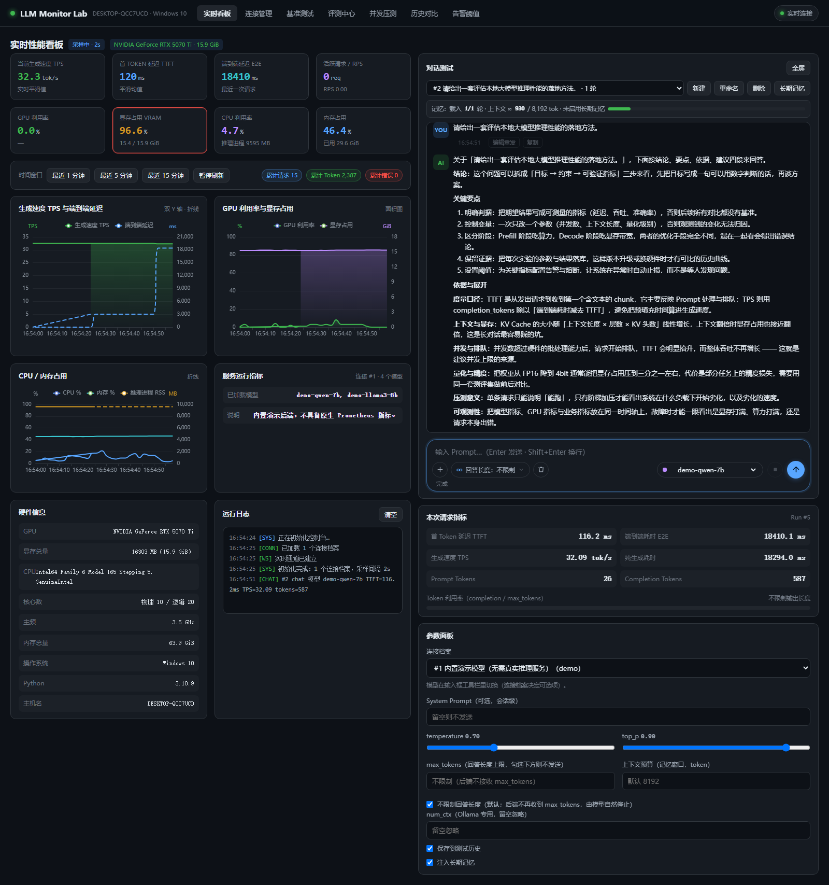

整个平台的主界面，**左右等宽双栏**：

* **左半屏 · 性能指标**：8 张 KPI 卡（TPS / TTFT / E2E / 活跃请求+RPS / GPU / VRAM / CPU / 内存）+
  4 张图（TPS·E2E 双轴折线、GPU·显存面积图、CPU·内存·进程 RSS 折线、服务原生指标）+ 硬件信息 +
  运行日志；时间窗口 1 / 5 / 15 分钟可切，暂停刷新后仍能回看历史窗口。
* **右半屏 · 对话测试**：会话下拉 + 记忆条 + 消息区 + 输入区 composer；一轮对话的提问、回答、
  指标行（TTFT / E2E / TPS / tokens / 终止原因）都在这里。
* 两半屏共享同一条 WebSocket 采样流，所以**对话进行中左边的 TPS 曲线会实时抬起来**——
  这正是把两者并排的原因。
* 图里显存卡是红的，那是**真实采集值**（本机同时跑着一个 27B 的 llama.cpp 服务，
  15.1 / 15.9 GiB ≈ 95%，越过了 90% 的告警阈值），不是演示数据。

### 4.2 连接管理

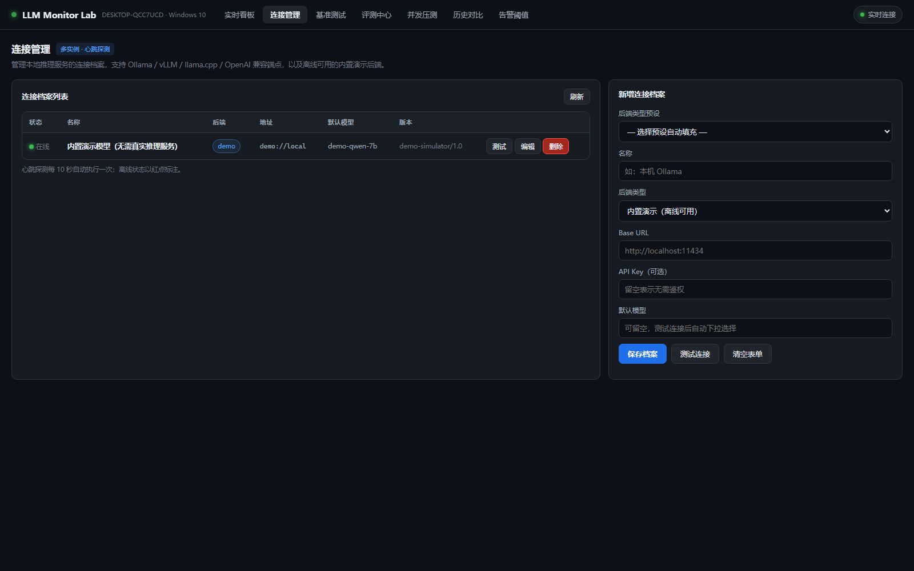

左侧是连接档案列表（状态灯 / 后端类型 / 地址 / 默认模型 / 版本 + 测试·编辑·删除），右侧是新增表单：
选一个后端预设（Ollama / vLLM / llama.cpp / OpenAI 兼容 / 内置演示）会自动填好 Base URL 与默认端口，
点「测试连接」会真的发一次请求并把模型列表拉回来。心跳探测每 10 秒刷新一次状态灯。

### 4.3 基准测试

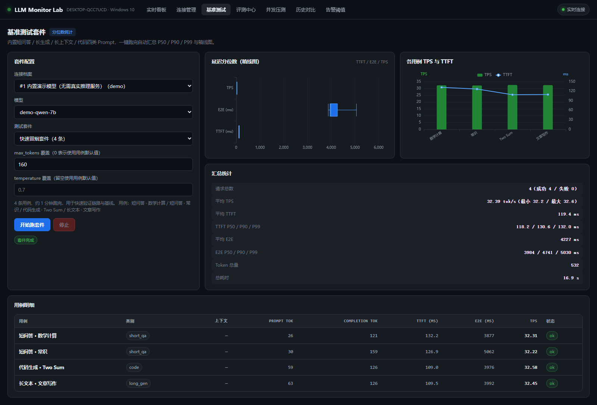

内置 5 个套件（快速冒烟 4 条 / 标准 / 长上下文 / 吞吐 / 全量回归，共 14 条用例）。
跑完给出**延迟分位数箱线图**（TTFT / E2E / TPS 三维度）、**各用例 TPS 与 TTFT 柱线图**、
**汇总统计**（平均 TPS、TTFT 与 E2E 的 P50/P90/P99、Token 总量、总耗时）以及逐用例明细表。

### 4.4 评测中心

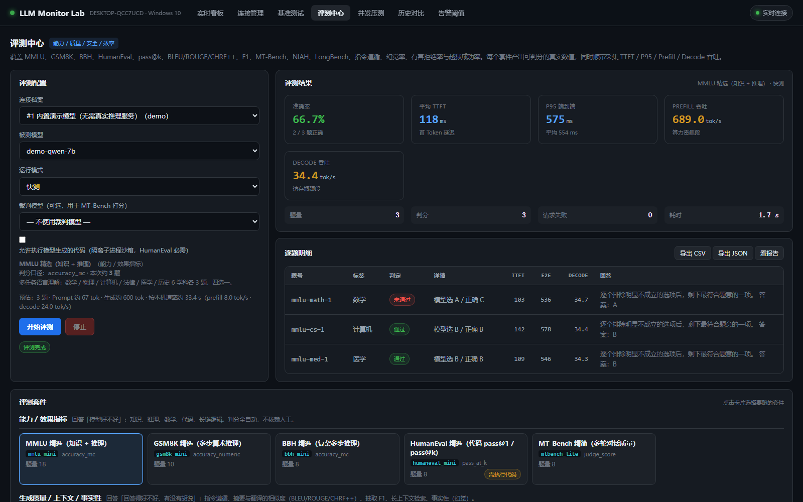

选连接、被测模型、运行模式（quick / standard / full）与裁判模型后跑套件。结果分三类：
**判分型**（准确率）、**打分型**（BLEU / ROUGE / CHRF++）、**判定型**（F1 / 通过率）；
同时顺带采集 TTFT / P95 / Prefill 吞吐 / Decode 吞吐，所以一次评测能同时得到「准不准」和「快不快」。

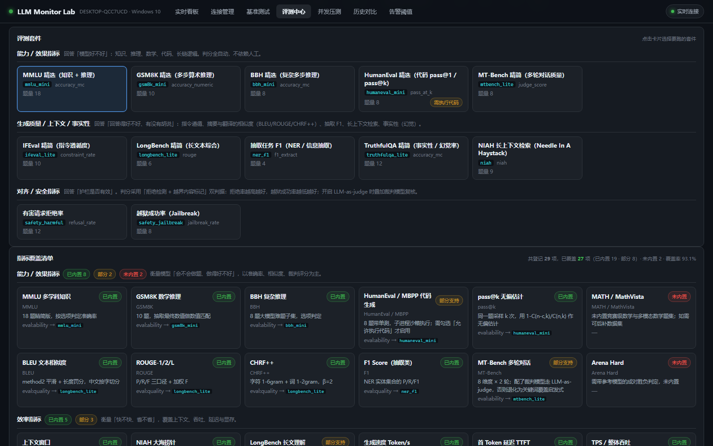

12 个套件按「能力 / 效果指标」「生成质量」「对齐 / 安全」分组；下方是**指标覆盖清单**——
四大类 29 项指标逐条登记为 已内置 / 部分支持 / 未内置 并给出数据来源，当前覆盖 **27 / 29（93.1%）**，
未覆盖的按设计留白，不做近似替代。

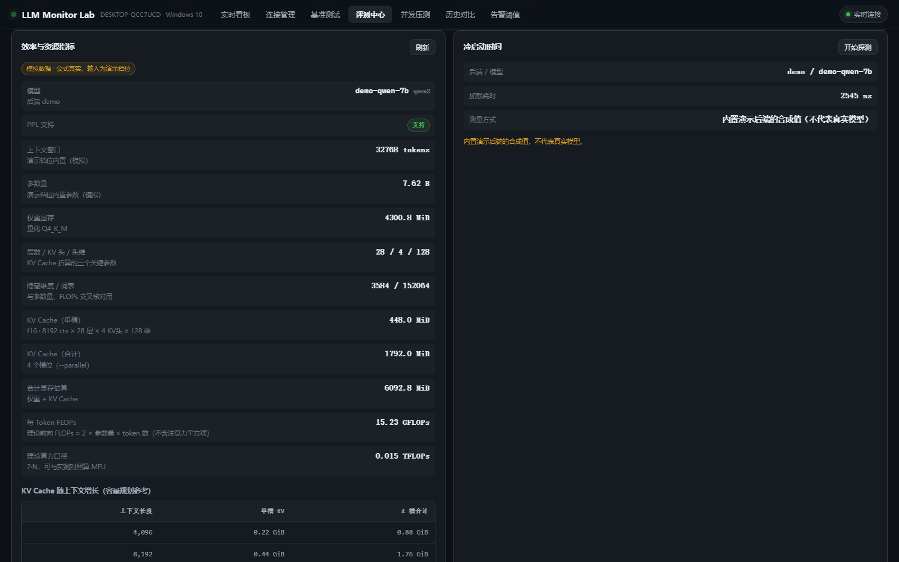

效率与资源指标：参数量、权重显存、KV Cache 单槽与 4 槽合计、合计显存、每 Token FLOPs、
KV Cache 随上下文长度的增长对照表；右侧是冷启动探测。**拿不到的指标就明确写「不支持」**
（演示后端没有 PPL 能力，就直接标 PPL 不支持），演示后端的数值一律带「模拟数据」标识。

### 4.5 并发压测

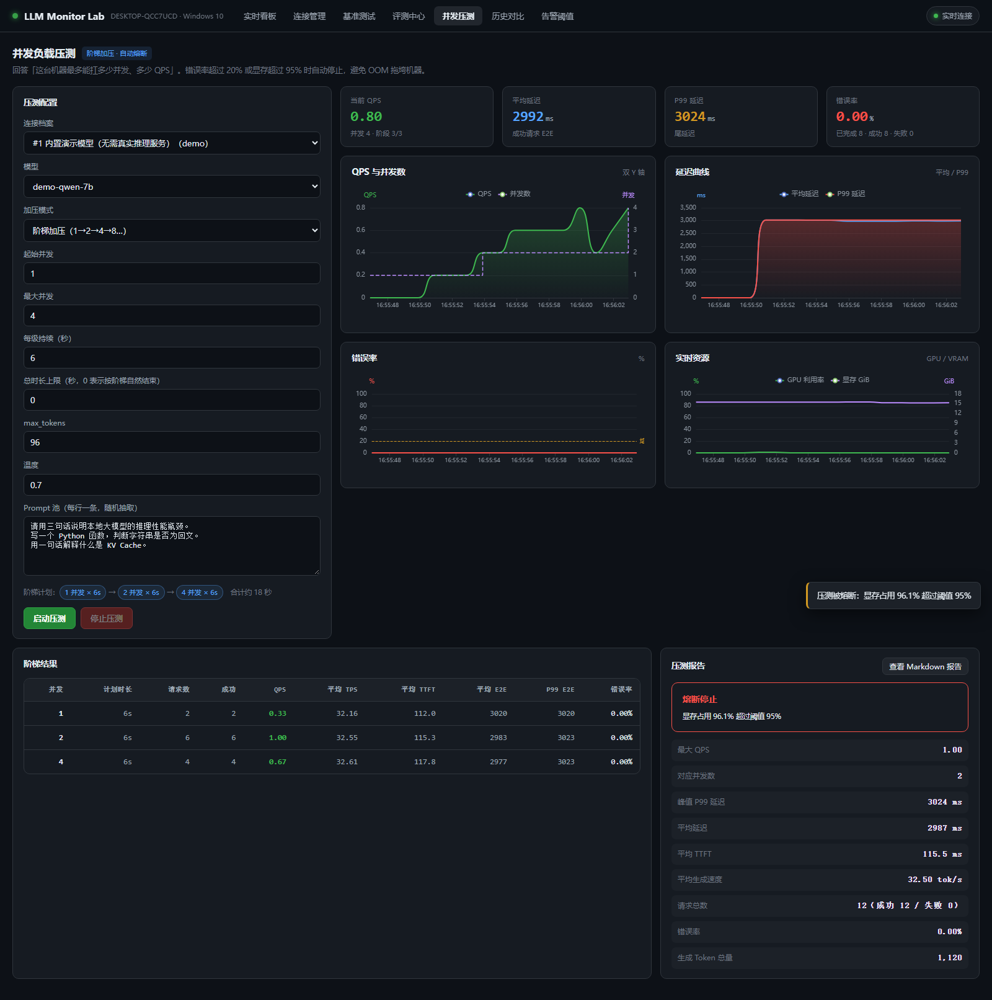

两种模式：**固定并发**与**阶梯加压**。实时看 QPS、并发数、平均 / P99 延迟、错误率、GPU 与显存，
逐级产出结果表；跑完给出压测报告（最大 QPS、**建议并发上限**、峰值 P99、平均 TTFT、
平均生成速度、请求总数、生成 Token 总量）。错误率 > 20% 或显存 > 95% 会自动熔断。

### 4.6 历史对比

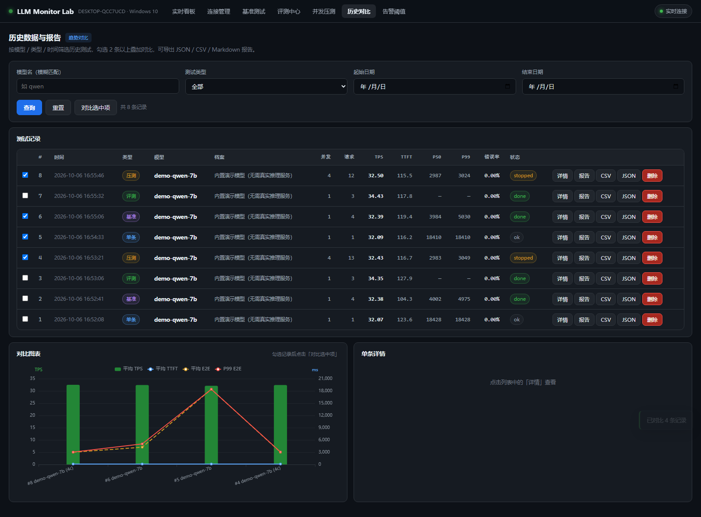

按模型（模糊匹配）/ 测试类型 / 日期范围筛选，勾选最多 6 条记录叠加对比：平均 TPS 柱 +
TTFT / E2E / P99 三条折线（双 Y 轴）；单条可看详情、导出 CSV / JSON、生成 Markdown 报告。
单条测试、基准、评测、压测的记录都会自动落库进来，图里就是同一个演示模型跑出来的 8 条历史。

### 4.7 告警阈值

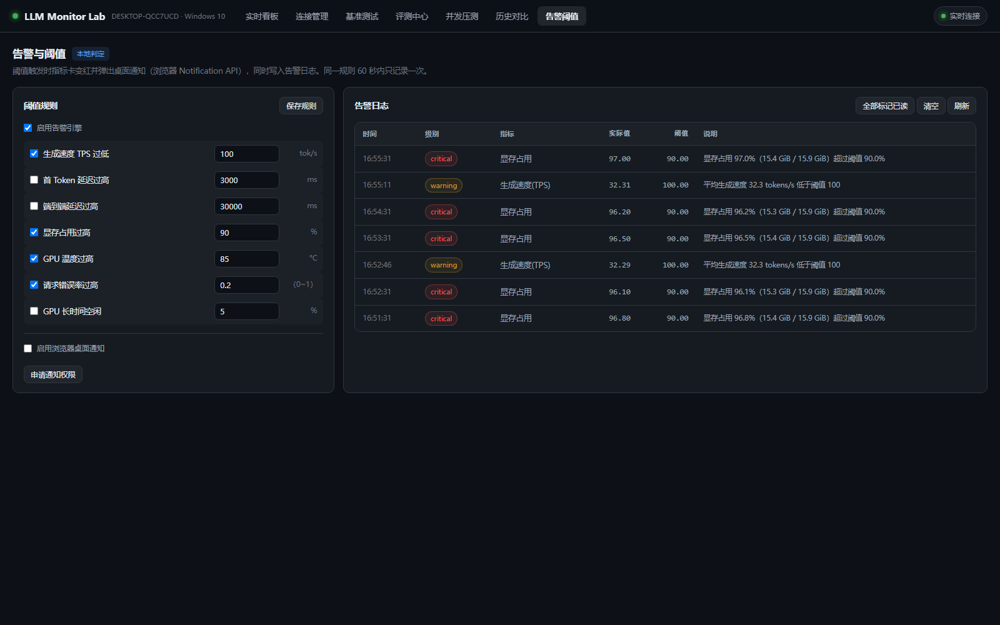

7 条规则（TPS 过低 / TTFT 过高 / E2E 过高 / 显存过高 / GPU 温度过高 / 错误率过高 / GPU 空闲），
每条单独开关与改阈值，同一规则 60 秒内只记一条避免刷屏；触发时指标卡变红 + 浏览器桌面通知。
上图里 5 条 `critical` 是真实采集值触发的（显存 95.1% > 90%），2 条 `warning` 是压测期间
平均生成速度低于 100 tok/s 触发的。

### 4.8 对话测试（全屏 · 富文本）

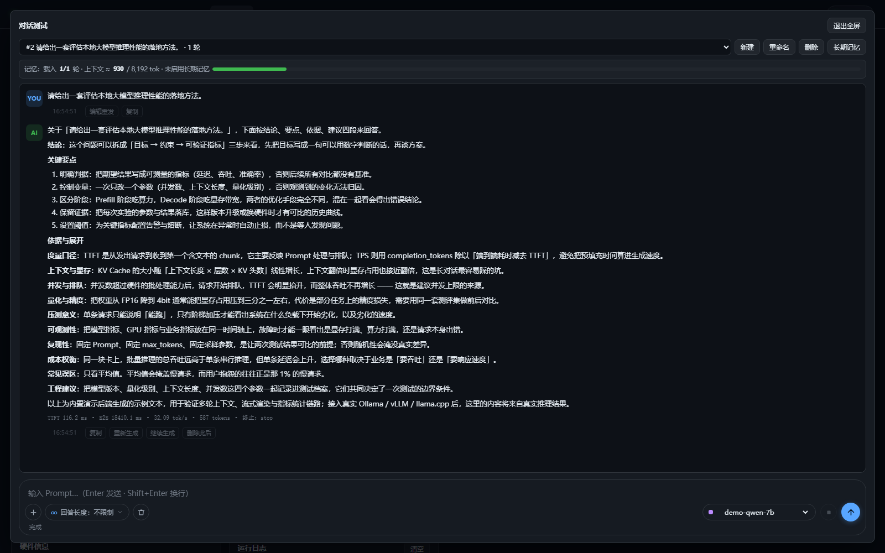

回答按 Markdown 渲染：标题、加粗、有序 / 无序 / 任务列表、引用、分隔线、表格，
以及**带语言标签和复制按钮的代码块**。安全模型是「先整体转义、再插入渲染器自己生成的标签」——
模型吐出的 `<script>` / `` 一律当纯文本，`javascript:` 伪链接直接丢弃。
输入区是圆角 composer（左上：＋ 新建 / 回答长度胶囊 / 清空；右侧：模型选择 / 停止 / 圆形发送）。
每条回答下可以复制、继续生成、重新生成、删除其后续。

### 4.9 窄屏下的看板

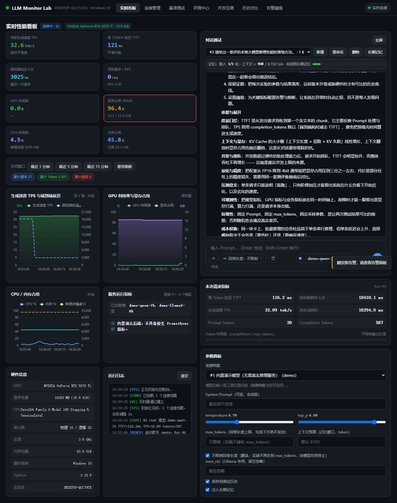

窗口收窄到 1300px（更窄也可以）时，KPI 卡从一行 4 张自动降为 2 张，图表与表格自适应栅格，
不出现横向滚动条。

> 重新出图：`CDP_HTTP=http://127.0.0.1:9224 TARGET_URL=http://127.0.0.1:8099 \
> OUTDIR=docs/screenshots node tools/capture_docs.mjs`。脚本会真跑一遍全流程再截图，
> 因此图始终与当前代码一致。

---

## 5. 指标口径

### 5.1 延迟与吞吐

* **TTFT** —— 发请求到收到第一个含文本 chunk 的毫秒数（流式响应里测，非流式时退化为 E2E）。
* **TPS** —— `completion_tokens / (E2E - TTFT)`，与后端自报 `usage` 交叉验证；Ollama 直接取
  `eval_count / eval_duration`。
* **E2E** —— 响应完整结束时间 − 请求发出时间。
* **P50 / P90 / P95 / P99** —— 对 TTFT 与 E2E 分别做分位数统计（线性插值）。
* **Prefill / Decode 拆分** —— 优先用后端自报的 prefill 时长（Ollama `prompt_eval_duration`、
  llama.cpp `timings.prompt_ms`）；拿不到时**仅在 `E2E - TTFT ≥ 5ms` 时**才用 TTFT 近似，
  并把口径标为 `ttft_proxy`。decode 窗口不足 5ms 直接跳过，**不做钳制**——否则会算出虚高几十倍的 TPS。
* **整体吞吐** —— `总 token / 墙钟时间`，与 `TPS`（单请求 decode 速度）是两个不同口径。
* **QPS** —— 成功请求数 / 有效压测时长；实时曲线用 5 秒滑动窗口。
* **RPS / 活跃请求** —— 后端自维护计数器，10 秒滑动窗口。
* **VRAM** —— NVML 多卡求和；GPU 利用率/温度取多卡最大值。

### 5.2 效率与资源

* **KV Cache** —— `bytes = slots × n_layer × n_ctx × n_head_kv × (key_len + value_len) × bytes_per_elem`。
  参数取自 llama-server 启动参数（`-c` / `--cache-type-k/-v` / `-np`）与 GGUF 元数据；
  KV 量化字节数按 llama.cpp 定义（f16=2.0、q8_0=34/32、q4_0=18/32 …），并给出「KV 随上下文增长」容量规划表。
* **参数量** —— 优先解析 GGUF 头部（`general.*` 元数据 + 张量维度累加），
  Ollama 走 `/api/ps` 的 `parameter_size`，演示后端用内置档位常量。
* **FLOPs** —— 理论前向 `≈ 2 × 参数量 × token 数`（不含注意力的平方项），
  `每 Token FLOPs` 与 `理论算力口径` 用于和实测吞吐对照算 MFU。
* **冷启动 / 模型加载** —— Ollama 用 `keep_alive: 0` 卸载后重发请求读 `load_duration`（真实加载耗时）；
  llama.cpp 常驻服务无法卸载，标注为「代理指标」并说明原因；演示后端标注「合成值」。

### 5.3 评测指标

判分结果按指标类型归一：`accuracy_mc` / `accuracy_numeric` / `pass_at_k` / `constraint_rate` /
`rouge`（含 rougeL）/ `f1_extract` / `refusal_rate` / `jailbreak_rate` / `judge_score` / `niah`。
派生指标包括幻觉率（TruthfulQA 反向）、rubric 覆盖率、NIAH 按上下文长度的通过矩阵。
`judge_score` 无裁判模型时不臆测分数，改用 rubric 覆盖率并标注 `score_source`。

### 5.4 不造数原则

任何拿不到的指标都返回不可用 + 原因，而不是填一个看起来像真的数字：
PPL 不支持就返回 `{ok: false, reason}`；KV Cache 参数不全就放弃折算；
演示后端的效率指标**公式真实、输入模拟**，一律带 `simulated: true`，前端显示明确的模拟数据标识。

### 5.5 对话测试（会话 · 记忆 · 不截断 · 富文本）

看板右半屏是一个**正式的聊天界面**（不是"试一句就断"的探针），设计约定如下：

* **富文本回答**
  * 回答按 Markdown 渲染（**自实现渲染器**，零外部依赖、离线可用）：标题 / 粗体 /
    斜体 / 删除线 / `==高亮==` / 行内代码 / **围栏代码块（带语言标签与一键复制）** /
    有序·无序·任务列表（含一级缩进）/ 引用 / 分隔线 / 表格 / 链接与裸链接自动识别
    （新窗口打开并带 `noopener`）。
  * **安全模型**：整段文本**先做 HTML 转义**，此后插入的标签全部由渲染器自己生成，
    模型输出里的 HTML 一律当纯文本；URL 另过 scheme 白名单（仅 `http / https / mailto`），
    因此 `<script>` 与 `javascript:` 伪协议都进不来。
  * **流式渲染**：每 60ms 节流重排一次（长回答不掉帧），收尾时强制落到最终内容；
    代码围栏在尚未闭合时按"到文末"渲染，不会在流中间闪断成裸反引号。
  * 离线回归：`node tools/md_render_check.mjs`（26 项断言，含 XSS 与伪协议用例）。
* **输入区（composer）**：圆角大框，上方是随内容自增高的 textarea，下方一排工具条 ——
  左侧「＋」新建会话、「回答长度」胶囊（下拉直选 不限制 / 1024 / 2048 / 4096 / 8192，
  与参数面板**共用同一份真相**）、清空对话；右侧模型选择、停止（生成中可用）、
  圆形发送按钮。编辑重发时按钮切为「重发」，Enter 发送 / Shift+Enter 换行 /
  Esc 取消编辑态；中文输入法组合过程中的 Enter 不会误触发发送。
* **不截断**
  * **默认就是「不限制回答长度」**（勾选在参数面板里，选择记进 localStorage）。
    勾选时面板**不下发** `max_tokens` 字段，输入框禁用并显示「不限制」，避免用户
    以为某个数字仍在生效；要设上限就取消勾选，输入框会回填上次用过的值。
  * 后端把 `max_tokens ≤ 0` 统一解释为"不限制"，并分别映射为 Ollama `num_predict: -1`、
    OpenAI 兼容接口**省略该字段**、llama.cpp `max_tokens/n_predict: -1`。
  * 三个后端都透出**终止原因**（Ollama `done_reason` / OpenAI `finish_reason` / llama.cpp
    `stop_type`），归一为 `stop` / `length` / `content_filter` 等；`length` 会在气泡上打
    标签说明**是谁截的**——面板设的上限就打「已 max_tokens 截断（上限 N）」，
    没设上限却撞了 `length` 就打「被服务端长度上限截断」，并提示去查
    llama-server 的 `-n/--n-predict`、Ollama 的 `num_predict` 或上下文窗口
    （落库时会记下本次下发的上限，所以标签不会冤枉人）。
  * **任何情况下都不在半句话上收尾**：演示后端按"段"装配回答，预算不够时丢弃整段
    （实测小 `max_tokens` 下结尾也落在句子边界）。
  * **继续生成**：把上一段的末尾 + 续写指令一起发给模型，落库为一条 `continued=1` 的
    assistant 消息（气泡带虚线 `cont` 样式），**不会新增 user 轮**，也不会把指令原文回显。
  * llama.cpp / vLLM 这类**带思考段的模型**：`reasoning_content` 也照常流式展示
    （用 `<think>…</think>` 包起来），因为它同样是模型真实产出——丢掉它会让思考期间
    界面只有「正在生成…」，TTFT 也会被记到第一段正文上，TPS 跟着虚高。
* **多轮上下文（短期记忆）**
  * 每轮把会话历史装配成 `messages` 下发，前端上下文指示条实时显示
    「载入 N/M 轮 · 上下文 ≈ x / budget tok」。
  * 预算裁剪：默认 8192 token（`LLM_MONITOR_CHAT_CTX_BUDGET`），**从最早的一轮开始丢**，
    最少保留最近 6 轮（`LLM_MONITOR_CHAT_KEEP_TURNS`）；丢过轮次时会在 System 里补一条
    裁剪说明，模型会**如实说"更早的对话没有带到"**，而不是假装记得。
  * 单条超长消息（> `LLM_MONITOR_CHAT_MAX_MSG_CHARS`）按比例压缩，避免一条粘贴吃满预算。
  * 重新生成（regenerate）：历史末尾与本轮提问相同时**去重**，不会留下两条连续的相同
    user 轮；上下文以"提问"结尾（丢掉旧回答），否则模型会把本轮提问误当成"上一轮"。
* **长期记忆（跨轮持久）**
  * 每个会话有一块 `memory` 文本，**始终拼进 System Prompt 且不参与预算裁剪**——
    裁剪只会丢历史轮次，不会丢记忆。
  * 可手写在「记忆」面板，也可点 **「提炼」**让模型从当前对话里抽要点；新增条目按行
    **去重合并**，不会重复写入或覆盖已有条目。
* **会话与持久化**
  * `chat_sessions` / `chat_messages` 两张表（SQLite WAL），消息带 `continued` / `truncated` /
    `finish_reason` / token 数；会话表由消息表推导轮数与累计 token。
  * 支持新建 / 重命名 / 删除会话、编辑重发（删除该条及其之后的消息再重发）、
    删除单条及其后、清空对话、全屏阅读。
  * 会话首轮提问自动作为标题（可在列表里辨认）；重启服务后历史仍在。

---

## 6. 后端适配说明

`probe.py` 中每个后端一个 Adapter，统一产出
`{delta, done, prompt_tokens, completion_tokens, meta}`：

| 后端 | 对话端点 | 原生指标 |
| --- | --- | --- |
| Ollama | `POST /api/chat`（流式，含 `eval_count`） | `GET /api/ps` 已加载模型与显存 |
| vLLM | `POST /v1/chat/completions`（SSE） | `GET /metrics` Prometheus（运行/排队请求数、KV Cache 占用、累计 Token） |
| llama.cpp server | `POST /v1/chat/completions`（**套用 GGUF 对话模板**，`timings_per_token` + `include_usage`）→ 不支持模板时退回 `POST /completion` | `GET /props` 配置信息 |
| OpenAI 兼容 | `POST /v1/chat/completions`（SSE / `usage`） | 无，后端自统计 |
| 内置演示 | 模拟流式输出 | 模拟器指标 |

**扩展新后端**：在 `probe.py` 加一个 `BaseAdapter` 子类 → 注册进 `ADAPTERS` 与
`BACKEND_PRESETS`，只需实现 `chat_stream()` 产出统一 chunk
`{delta, done, prompt_tokens, completion_tokens, meta}`，上层 `tester.py` / `evaluator.py` 无需改动。

> **llama.cpp 为什么要走 chat 接口而不是 `/completion`**（实测踩坑）：
> `/completion` 收的是**裸文本**，不会套用 GGUF 里的对话模板。用
> `User: ...\nAssistant:` 这种手拼格式发给带思考段的 instruct 模型
> （如 `Ternary-Bonsai-2-27B`），服务端会直接返回 `stop_type=eos, predicted_n=1`、
> 正文为空 —— 界面上看起来就是「刚输出一点就没了」。改成 `/v1/chat/completions` 后
> 同一个问题能正常产出。适配器先 `GET /props` 看服务端是否带对话模板（结果按 base_url
> 进程级缓存），带模板才走 chat 接口，否则退回 `/completion`。
>
> 另外 llama.cpp / vLLM 的流式响应里 **`finish_reason` 与 `usage` 不在同一帧**
> （先发终止原因，再补一帧仅有 usage 的收尾帧），解析时必须记住最后一次非空的
> `finish_reason`，否则收尾事件会把它丢成 null，终止原因就永远显示不出来。

**能力声明**（`BaseAdapter` 上的类属性）决定上层行为：

| 属性 | 作用 |
| --- | --- |
| `supports_ppl` | 是否支持 PPL；为假时接口直接返回不可用 + 原因，不做臆测 |
| `RAISE_LIMITS` | 该后端支持的采样参数，避免下发不被识别的字段 |
| `hints_gold` | **仅内置演示后端为真**：评测框架会把标准答案随请求下发，用来模拟能力曲线。真实后端此值为假，标准答案不会进入 HTTP 请求，无泄题风险 |

---

## 7. API 一览

| 方法 | 路径 | 说明 |
| --- | --- | --- |
| GET | `/api/health` · `/api/system/info` · `/api/overview` | 健康检查 / 硬件静态信息 / 聚合概览 |
| GET | `/api/backends/presets` | 后端预设列表 |
| GET/POST/PUT/DELETE | `/api/connections[/{id}]` | 连接档案 CRUD |
| POST | `/api/connections/{id}/test` · `/api/connections/probe` | 连接测试（已存 / 未存） |
| GET | `/api/models?conn_id=` | 模型列表 + 原生指标 |
| POST | `/api/test/single` | 对话测试（**SSE** 流）；带 `session_id` 时自动装配多轮上下文 + 长期记忆并落库 |
| GET/POST | `/api/chat/sessions` | 会话列表（含轮数/累计 token） / 新建会话 |
| GET/PATCH/DELETE | `/api/chat/sessions/{sid}` | 会话详情（含全部消息） / 改标题·记忆·模型 / 删除 |
| DELETE | `/api/chat/sessions/{sid}/messages?from_id=` | 删除该消息及其之后（编辑重发 / 重新生成用） |
| DELETE | `/api/chat/sessions/{sid}/messages/{mid}` | 删除单条消息 |
| POST | `/api/chat/sessions/{sid}/memory/distill` | 让模型从当前对话提炼长期记忆 |
| GET | `/api/test/suites` | 套件与用例清单 |
| POST | `/api/test/benchmark` | 启动基准套件（异步，返回 run_id） |
| POST | `/api/test/loadtest/start` · `/api/test/stop` | 启动 / 停止压测 |
| GET | `/api/test/active` | 进行中任务进度 |
| GET | `/api/eval/suites` | 评测套件与分组清单 |
| GET | `/api/eval/estimate?suite_id=&mode=` | 预估题量与耗时 |
| POST | `/api/eval/start` | 启动评测（异步，返回 run_id；含占用检查与 pass@k 沙箱检查） |
| GET | `/api/eval/{run_id}` | 评测结果（逐题明细 + 汇总） |
| GET | `/api/eval/{run_id}/export?fmt=csv\|json` | 评测结果导出 |
| GET | `/api/metrics/catalog` | 指标覆盖清单（四大类 29 项 + 覆盖率汇总） |
| GET | `/api/metrics/efficiency?conn_id=&model=` | 效率与资源：KV Cache 折算 / 权重显存 / FLOPs / 上下文窗口 |
| POST | `/api/metrics/cold-start` | 冷启动 / 模型加载耗时探测 |
| GET | `/api/runs` · `/api/runs/{id}` · `/api/runs/compare?ids=` | 历史列表 / 详情+分位数 / 对比 |
| GET | `/api/runs/{id}/export?fmt=csv\|json` · `/api/runs/{id}/report` | 导出 / Markdown 报告 |
| GET | `/api/metrics/realtime?seconds=` · `/api/metrics/latest` | 时序采样查询 |
| GET/PUT/POST/DELETE | `/api/alerts` · `/api/alerts/rules` · `/api/alerts/ack` | 告警日志与规则 |
| WS | `/ws` | 推送 `hello` / `metrics` / `progress` / `stage_done` / `run_done` / `eval_progress` / `eval_done` / `alerts` |

---

## 8. 安全与注意事项

* **压测接口无鉴权**：只监听本机或内网，切勿暴露公网。
* **熔断保护**：错误率 > 20% 或 VRAM > 95% 自动停止；开发自测请从 1~2 并发验证正确性后再加大。
* **评测代码执行沙箱**：`humaneval_mini` 若开启「允许代码执行」，会在独立临时目录中用
  `sys.executable -I -S` 起隔离子进程，8 秒超时，并先过静态黑名单（`subprocess` / `socket` /
  `shutil.rmtree` / `eval(compile(...))` 等）。**默认关闭**；仅在可信环境按需打开。
* **显存余量**：VRAM 接近占满会触发系统 OOM，建议保留 2 GB 以上余量。
* **采样保留**：原始采样默认保留 7 天，每小时自动清理更早数据（`LLM_MONITOR_RETENTION_DAYS`）。
* **压测与评测互斥**：已有任务运行时，新的压测 / 评测请求会被拒绝（HTTP 409），避免指标互相污染。

---

## 9. 验证工具

`tools/` 下脚本用本机 Chrome 的 DevTools Protocol 做真实浏览器验证（无第三方依赖，
仅用 Node 18+ 内置 `fetch` / `WebSocket`）。先启动服务，再启动带调试端口的 Chrome，然后运行：

```bash
chrome --headless=new --remote-debugging-port=9222 --user-data-dir=/tmp/chromeprof about:blank
SHOT=dash.png node tools/verify_ui.mjs        # 首屏：控制台异常 + DOM 状态 + 截图
OUTDIR=shots node tools/verify_flows.mjs      # 全流程：切面板 + 跑压测 + 跑对话 + 跑套件
TARGET_URL=http://127.0.0.1:8081 OUTDIR=shots node tools/verify_dash_split.mjs
                                              # 看板布局：左右列 50/50 比例 + 图表尺寸 + 看板内对话链路
OUTDIR=shots node tools/verify_dash_split_extra.mjs
                                              # 回归：对话指标落盘 + 历史对比 + 各面板图表 + 窄屏 1300
CDP_HTTP=http://127.0.0.1:9224 TARGET_URL=http://127.0.0.1:8099 OUTDIR=shots \
  node tools/verify_eval_ui.mjs               # 评测中心：7 tab + 指标清单 + 效率数值断言 + 真跑套件
CDP_HTTP=http://127.0.0.1:9224 TARGET_URL=http://127.0.0.1:8099 OUTDIR=shots \
  node tools/verify_chat_ui.mjs               # 对话测试：74 项断言，富文本 / 输入区 / 多轮记忆 / 不截断 / 续写 / 重生 / 全屏
node tools/md_render_check.mjs                # 富文本渲染器离线校验（26 项，不需要浏览器与服务）
CDP_HTTP=http://127.0.0.1:9224 TARGET_URL=http://127.0.0.1:8099 OUTDIR=docs/screenshots \
  node tools/capture_docs.mjs                 # 界面截图采集：真跑全流程后出图，直接更新第 4 章那批图
.venv/Scripts/python.exe tools/chat_smoke.py  # 对话链路纯后端冒烟（36 项断言，无需浏览器，库走 $TEMP）
APP_URL=http://127.0.0.1:8099 .venv/Scripts/python.exe tools/unlimited_probe.py
                                              # 真实后端「不限制输出长度」验证（默认打 127.0.0.1:8080）
```

> **按钮驱动的流式操作必须"先等开始、再等结束"**：`继续生成` / `重新生成` 走的是 click，
> 拿不到 `send()` 的 promise。而 `send()` 在把运行标志置位前先 `await` 了一次网络往返
> （重新生成要先 DELETE 旧回答），这段空窗期里"运行中"仍是 false——直接轮询 `!running`
> 会**立刻返回 true**，读到的正好是"旧回答已删、新回答还没生成"的中间态（实测表现为
> `msgCount 5→3`、`roles=user,assistant,user` 的假失败）。脚本里用 `waitRun()` 两段式等待解决。
> `capture_docs.mjs` 里的 `waitTask()` 是同一个道理：压测/基准的按钮点下去后也是异步置位，
> 不等"先变 disabled"就会截到「压测进行中、表格还空着」的废图。

> **整页截图前要回到顶部**：`Page.captureScreenshot{captureBeyondViewport:true}` 在页面已滚动时，
> 会把 `position: fixed` 的顶栏渲染到页面**中部**，出来一条"重影"的导航条。
> `capture_docs.mjs` 因此每次整页截图前都先 `window.scrollTo(0, 0)`。

> **前端语法闸门**：`verify_eval_ui.mjs` / `verify_chat_ui.mjs` 在连浏览器之前，会先把服务端返回的
> `/app.js`、`/eval.js`、`/chat.js` 抓下来解析一遍（`new Function`，只解析不执行）。踩过一次坑——
> 模板串里嵌三元漏了一个 `else` 分支，整个 `eval.js` 静默失效，页面只是"像没加载完"，
> 控制台仅一行 SyntaxError，极易误判成网络慢。任何脚本解析失败直接 `exit 3`，把问题挡在浏览器之前。
>
> **DOM 契约闸门**：同一个闸门还会核查「JS 里 `$('x')` 引用的 id 是否真的存在」——改版时删掉或注释掉
> 一段 HTML、却忘了 JS 还在写它，这种问题**不会有语法错**，只在运行时抛一次
> `Cannot set properties of null`。踩过一次：看板双栏改版把 `#intervalTxt` 注释掉了，
> `app.js` 里那句赋值让每条 WebSocket `hello` 消息都抛一次异常，潜伏了很久。
> 现在两侧脚本都会先比对 `frontend/index.html` 的 id 集合，索引到不存在的元素即 `exit 3`。
>
> 脚本的 stdout 是**纯 JSON**（便于管道给 `jq` / Python 解析），进度与失败信息全部走 stderr；
> 断言不过会 `exit 2`。

后端也有两套不依赖浏览器的自测：

```bash
python backend/metrics_ext.py --selftest   # 纯算法指标库：BLEU/ROUGE/CHRF++/PPL/KV/FLOPs 数值断言
python tools/eval_smoke.py                 # 评测冒烟：demo 后端把 12 个套件各跑一遍并校验落库
```

> 服务端口不是 8080 时，用 `TARGET_URL` 覆盖脚本里的目标地址；想验证不同视口宽度，
> 用 `VW` / `VH` 环境变量（脚本内部走 `Emulation.setDeviceMetricsOverride`，比 `--window-size` 可靠）。

---

## 10. 指标覆盖现状

「评测中心 → 指标覆盖清单」把指标分成四大类共 **29 项**并逐项标注可用性，
当前 **已覆盖 27 项（93.1%）**：已内置 19 项、部分可用 8 项。

尚未内置的 2 项（清单中已登记为 `planned`，如实标出而不是假装有）：

* **MATH / MathVista** —— 需要带图形与 LaTeX 解析的评测流水线，当前仅 GSM8K 覆盖纯文本数学推理。
* **Arena Hard** —— 需要大规模匿名对战与 Elo 统计，超出本地单机场景。

---

## 11. 后续可扩展（V2）

多机分布式采集 agent、告警 Webhook（飞书/钉钉/企业微信）、模型版本与量化级别自动关联、
业务 Prompt 回归库、报告导出 PDF、Docker Compose 一键编排。
